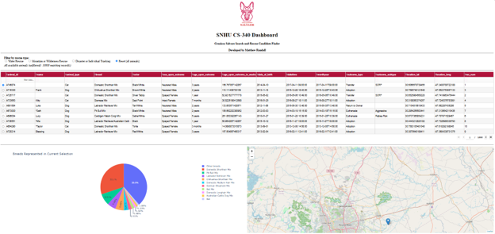
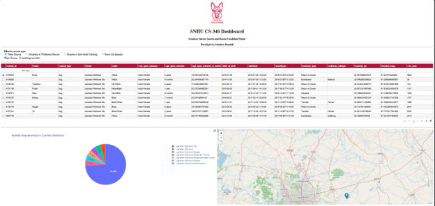
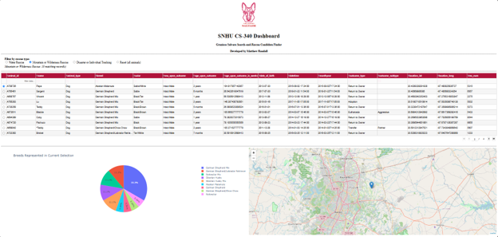
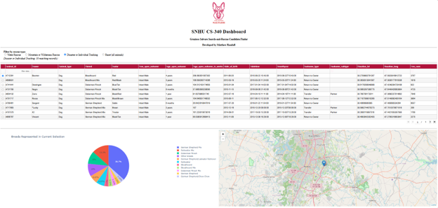
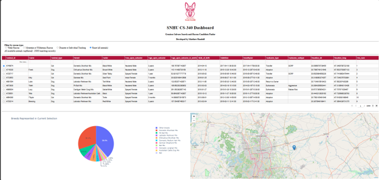

# CS 340 — Grazioso Salvare Dashboard

An interactive web dashboard that lets Grazioso Salvare identify dogs in the Austin Animal Center outcomes data that match their search-and-rescue training profiles.

## About the Project

Global Rain was contracted to build a full stack application for Grazioso Salvare, an international rescue-animal training company that identifies dogs suited to search-and-rescue work. The client receives outcome data from a nonprofit operating five animal shelters around Austin, Texas, and needs a way to search it for candidate dogs.

The first phase is a portable, object-oriented CRUD module giving programmatic access to the Austin Animal Center data in MongoDB. The `AnimalShelter` class connects to the `aac` database and `animals` collection and implements all four CRUD operations.

The second phase is the client-facing dashboard built on top of that module. It reads through the same class, filters down to the dogs matching a given rescue profile, and presents the results as an interactive data table, a breed pie chart, and a geolocation map. No part of the interface queries MongoDB directly.

## Motivation

Grazioso Salvare looks for specific profiles when selecting dogs to train: search-and-rescue work is generally more effective on dogs no more than two years old, and different breeds are proficient at different specialties. Each profile is a query against breed, sex, and age.

Identifying a candidate by hand means scanning roughly ten thousand shelter records for a narrow combination of those three fields. The dashboard turns that search into a single click, and centralizing all database interaction in one importable module means either layer can change independently of the other.

## Dashboard Functionality

- **Branding** — the Grazioso Salvare logo wrapped in an anchor tag, and a unique identifier crediting the developer.
- **Interactive filter options** — a radio-button group offering Water Rescue, Mountain or Wilderness Rescue, Disaster or Individual Tracking, and Reset. Each option runs its own query against MongoDB through the CRUD module rather than filtering a cached copy in Python.
- **Interactive data table** — paginated ten rows at a time, sortable and filterable on every column, with single-row selection. Rebuilds from the query results each time the filter changes.
- **Geolocation chart** — a Leaflet map centered on Austin, dropping a marker on the selected animal with breed on the tooltip and name in the popup.
- **Breed chart** — a pie chart of the breeds in the current table view. The ten most common are labelled individually and the remainder grouped into a single "Other breeds" slice.
- **Record count** — a line beneath the filter reporting the rescue type and the number of records returned.

| Rescue Type | Preferred Sex | Training Age | Records |
|---|---|---|---|
| Water | Intact Female | 26–156 weeks | 23 |
| Mountain or Wilderness | Intact Male | 26–156 weeks | 18 |
| Disaster or Individual Tracking | Intact Male | 20–300 weeks | 30 |
| Reset | — | — | 10,000 |

## Built With

**MongoDB** · **PyMongo** · **Python 3** · **JupyterLab** · **Dash** · **JupyterDash** · **Dash Leaflet** · **Plotly Express** · **pandas**

## Repository Contents

| File | Description |
|------|-------------|
| `CRUD_Python_Module.py` | The `AnimalShelter` class — create, read, update, and delete operations against MongoDB |
| `ProjectTwoDashboard.ipynb` | The dashboard application |
| `CS_340_Project_Two_README.docx` | Full project documentation with development notes and screenshots |

## Getting Started

1. Confirm the data set is present:
   ```
   ls datasets/
   ```
2. Import it with `mongoimport`:
   ```
   mongoimport --type=csv --headerline --db=aac \
     --collection=animals ./datasets/aac_shelter_outcomes.csv
   ```
3. Confirm the output reports 10,000 documents imported and 0 failures.
4. Open the shell and switch to the admin authentication database:
   ```
   mongosh
   use admin
   ```
5. Create the application account. Using `passwordPrompt()` keeps the password out of shell history:
   ```
   db.createUser({
     user: "aacuser",
     pwd: passwordPrompt(),
     roles: [{ role: "readWrite", db: "aac" }]
   })
   ```
6. Exit and log back in as the new account to verify it:
   ```
   exit
   mongosh --username "aacuser" --authenticationDatabase admin
   ```
7. Confirm the role with `db.runCommand({connectionStatus: 1})`.
8. Place `CRUD_Python_Module.py` in the same directory as the notebook that will use it.
9. Install the dashboard dependencies:
   ```
   pip install dash jupyter-dash dash-leaflet plotly pandas
   ```
10. Place `ProjectTwoDashboard.ipynb` and the Grazioso Salvare logo PNG in that same directory.
11. Open the notebook and set the `username` and `password` variables in the model section to the credentials created in step 5.
12. Select Kernel, then Restart Kernel and Run All Cells.
13. Open the proxied URL printed by `app.run_server()`. If port 8050 is in use, pass an alternate port.

## Screenshots



*The dashboard in its starting state — all 10,000 records, with the data table, breed pie chart, and geolocation map.*



*Water Rescue — 23 records, all intact females between 26 and 156 weeks.*



*Mountain or Wilderness Rescue — 18 intact males. The pie legend shows the anchored breed pattern matching German Shepherd variants and mixes.*



*Disaster or Individual Tracking — 30 records across the widest age range, 20 to 300 weeks.*



*Reset from a filtered state — every widget returns to its original condition and the count returns to 10,000.*

---

# Reflection

## How do you write programs that are maintainable, readable, and adaptable?

The clearest example from this course is the CRUD module I wrote in Project One and then reused in Project Two without changing a line of it. Building it as a standalone class meant the dashboard only ever calls `read()`, `create()`, `update()`, and `delete()`. Everything about how the connection is made — the host, the port, the URI construction, the `authSource=admin` requirement — stays inside one file. When I built the dashboard I was thinking about callbacks and layout, not connection strings.

Several specific decisions in that module made it easier to build on top of.

`read()` returns a list rather than the cursor PyMongo hands back. A cursor is lazily evaluated and consumed once iterated, so a second pass over it silently returns nothing — a genuinely confusing failure inside a Dash callback where the data simply disappears with no error. Walking the cursor once and returning a list gives the caller something reusable.

`update()` and `delete()` return the count of documents affected rather than a boolean, which distinguishes "succeeded and changed three records" from "succeeded and matched nothing." `update()` specifically returns `modified_count` rather than `matched_count`, since a document that already holds the value being written gets matched without actually changing.

`update()` also accepts either form of its update argument — a MongoDB operator like `{'$set': {...}}`, or plain key/value pairs that it wraps in `$set` itself. Accepting the operator form means `$inc` and `$unset` still work through the same method rather than needing a second one.

The module catches `PyMongoError` rather than a bare `Exception`, so a bug in my own calling code surfaces as the error it actually is instead of being mislabeled a database failure. It logs through the `logging` module rather than printing, which lets whatever imports it decide where messages go — a notebook cell in Project One, a server log in Project Two. Credentials are constructor arguments rather than module constants, and the password is percent-encoded before being placed in the URI, since `@`, `:`, and `/` all carry meaning inside a connection string.

Adaptability showed up in a way I did not anticipate. The starter dashboard code addressed the latitude, longitude, breed, and name fields by numeric column position. That works only as long as MongoDB returns fields in the expected order, and it broke the moment I normalized the column order for the data table. Looking values up by column name removed the dependency entirely. Positional access is the kind of shortcut that works until something upstream changes, which is exactly what maintainable code has to survive.

I could reuse this module for anything backed by the same database: a command-line reporting tool, a scheduled job flagging animals held past a certain date, or an intake form that writes new records. Because credentials are passed in, a read-only reporting script and a write-capable intake tool can share one implementation at different permission levels.

## How do you approach a problem as a computer scientist?

This project started with the data rather than the interface, which reverses how I have approached most assignments. Before writing dashboard code I queried the collection directly in the shell to see what was actually in it — how breeds were spelled, how sex and age were recorded, what the outcome types were.

That exploration changed the implementation in ways the specification alone would never have surfaced. Matching the breed field against the exact strings in the requirements table returned almost nothing, because the shelter records the majority of dogs as mixes and crosses. An anchored, case-insensitive regular expression solved it: the pattern matches any breed beginning with a preferred breed name, catching "German Shepherd Mix" and "German Shepherd/Labrador Retriever" while still excluding unrelated breeds like "Australian Shepherd Mix" that an unanchored pattern would pull in. Reviewing the distinct breed values also revealed that Doberman Pinscher is stored as "Doberman Pinsch," so a query written faithfully from the requirements document would have returned nothing for that breed and given no indication anything was wrong.

The other difference was treating the client's requirements as the specification rather than treating the rubric as the specification. A breed pattern that is slightly wrong means a trainer never sees a suitable dog and has no way of knowing. So I verified each filter against the data set directly rather than confirming the table populated with something — Water Rescue returns 23 records, Mountain or Wilderness 18, Disaster or Individual Tracking 30. Those counts matching independent checks is what makes the queries correct rather than merely plausible.

The same instinct shaped how I tested the CRUD module. Every document the test script inserts carries a `test_record` marker, and the update and delete cells filter on it. Since both methods act on all matches, that marker is what guarantees the tests cannot touch the imported shelter data. I insert two documents rather than one so the returned counts demonstrate both methods acting on every match instead of only the first.

The most important architectural decision was pushing filtering into MongoDB rather than loading the collection and narrowing it with pandas. Each rescue type is a query document, and the database returns only matching records, so the table, the pie chart, and the map are always drawn from the same server-side result. Filtering in Python would have been easier to write and would work at this size, but it discards the database's indexing and query planning and does not scale.

For future client work I would keep the same order: understand the data first, define the interface between layers before building either side, and push data operations down to the database. I would also settle the data-access layer's return types in writing up front, since those decisions from Project One shaped everything built on top of them.

## What do computer scientists do, and why does it matter?

Computer scientists take problems people are currently solving slowly, inconsistently, or not at all, and build systems that solve them reliably. The technical work is a means to that end — the value is not in the code but in what becomes possible once it exists.

This project is a small, concrete illustration. The Austin Animal Center outcomes data is public and already contains everything Grazioso Salvare needs. What it lacks is any way for a trainer to ask a question of it. Without the dashboard, finding candidate dogs means scanning ten thousand records by hand or learning MongoDB query syntax. The dashboard reduces that to selecting a radio button, and the map surfaces something the raw records do not readily give up — where the candidates physically are.

It also makes the search more consistent than a person doing it manually. The breed matching is one pattern applied identically every time, rather than whatever spellings a given searcher happens to think of on a given day. The mixed-breed problem is the clearest case: a trainer searching for "German Shepherd" by eye would likely skip past "German Shepherd/Labrador Retriever" entirely, and a qualifying dog would go unnoticed.

The practical result is that more time goes to training animals and less to data handling, and fewer suitable dogs are missed. That is the general shape of the work: shortening the distance between the information an organization already has and the decisions it needs to make with it.

## Resources

- [MongoDB documentation](https://www.mongodb.com/docs/)
- [PyMongo documentation](https://pymongo.readthedocs.io/en/stable/)
- [Dash documentation](https://dash.plotly.com/)
- [Dash DataTable reference](https://dash.plotly.com/datatable)
- [Dash Leaflet documentation](https://www.dash-leaflet.com/)
- [Plotly Express documentation](https://plotly.com/python/plotly-express/)
- [pandas documentation](https://pandas.pydata.org/docs/)
- [Austin Animal Center Outcomes data set](https://doi.org/10.26000/025.000001)

## Contact

Matthew Randall
Southern New Hampshire University | CS 340: Client/Server Development
